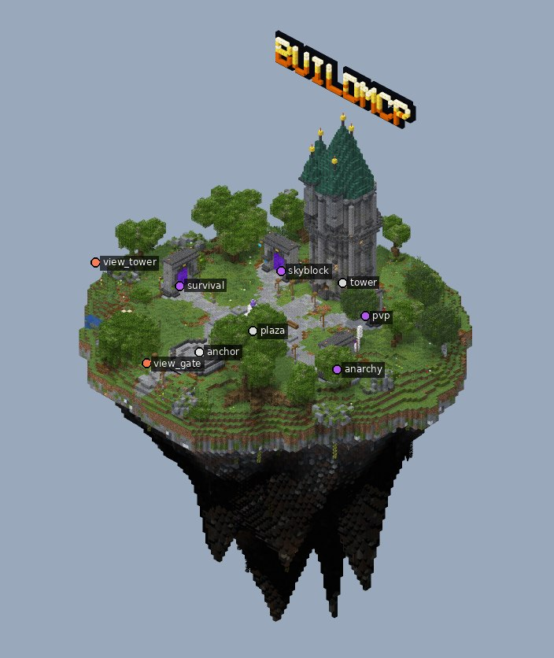
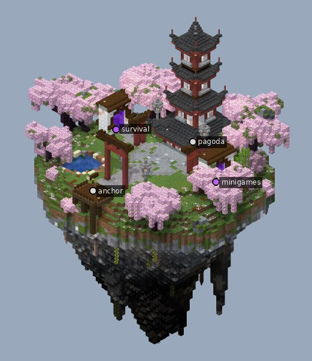
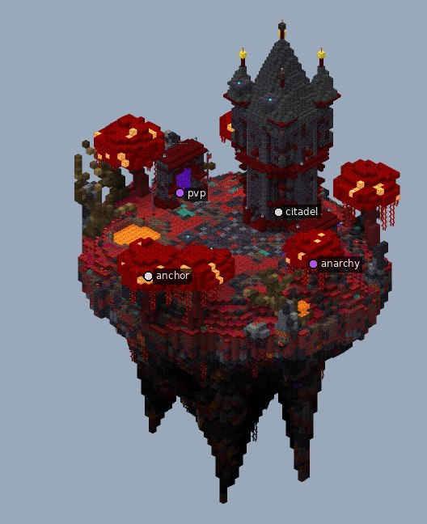
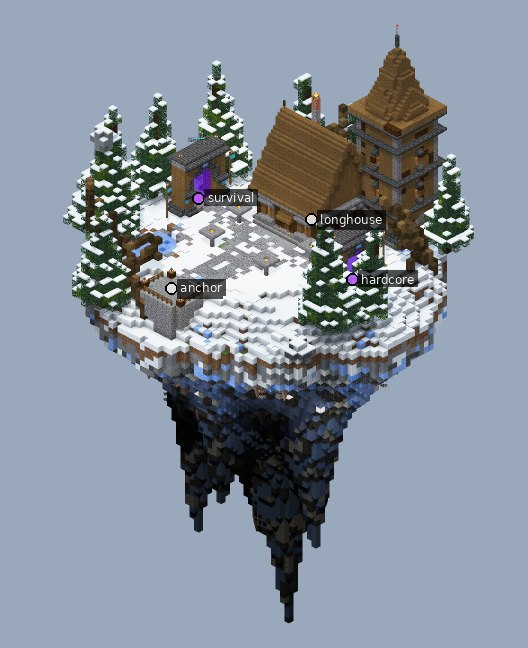

# BuildMCP

Плагин для Claude Code, с которым Claude строит Minecraft-спавны уровня топ-серверов: пишет процедурные скрипты постройки, смотрит на результат через рендер с настоящими текстурами, проверяет качество и сам вставляет готовое на сервер. А ещё поднимает сервер или целую сеть: ядра, плагины, конфиги, Velocity, свои плагины.


> Статус: в разработке. План: [docs/PLAN.md](docs/PLAN.md).

## Что внутри

- **MCP-сервер `buildmcp`** (Python): движок блоков, генераторы (острова, деревья, крыши, башни, дороги, 3D-текст), рендер, экспорт `.schem`, вставка на сервер.
- **Skill `spawn-builder`**: методичка по про-спавнам (композиция, палитры, глубина, органика, свет).
- **Агент `build-critic`**: смотрит рендеры и говорит, что исправить.
- **Мост BuildBridge** (плагин для Paper 1.21.x и 26.x, WorldEdit не нужен): через него Claude вставляет постройки на сервер 1:1, с бэкапом и отменой, читает мир и видит, где стоит игрок.
- **Сервер целиком** (skill `server-admin`): Claude ставит Paper, Purpur, Folia или Velocity, запускает и следит за логами, ставит и настраивает плагины, связывает сеть, пишет и собирает свои плагины. Простую текстовую работу он отдаёт Gemini CLI или Mistral, чтобы беречь лимиты. Строит спавны всегда только сам Claude.

## Примеры

Все примеры собраны самим Claude через инструменты плагина. Для каждого в [`examples/`](examples) лежат:
- `.schem` для WorldEdit и моста;
- рендеры днём и ночью;
- скрипты сборки.

| | Стиль | Что внутри |
|---|---|---|
| [](examples/fantasy_hub) | [**Фэнтези-хаб**](examples/fantasy_hub) | Летающий остров, маг-башня с горящими окнами, мраморный фонтан, логотип, 4 портала режимов, пруд и водопад |
| [](examples/antique_hub) | [**Античный хаб под 1 NPC**](examples/antique_hub) | Римский храм с NPC в портике, мозаичный форум с фонтаном, руина Колизея с рынком и красным веларием, пергола, медный купол, пальмы и кипарисы, водопад |
| [](examples/asian_sakura) | [**Азия / сакура**](examples/asian_sakura) | Пагода в рамке больших тории, сакуры, пруд с кувшинками, бамбук, каменные фонари, 2 портала |
| [](examples/dark_infernal) | [**Тёмный / адский**](examples/dark_infernal) | Цитадель с башенками, парадная дорога, багровые грибы, лавовый пруд и лавопад, базальтовые шипы, 2 портала |
| [](examples/winter_north) | [**Зима / север**](examples/winter_north) | Длинный дом и дозорная башня, заснеженная дорога, замёрзший пруд, ели в снегу, 2 портала |

## Установка (Claude Code на ПК)

1. Поставь [uv](https://docs.astral.sh/uv/getting-started/installation/):
   - Windows (PowerShell): `powershell -ExecutionPolicy ByPass -c "irm https://astral.sh/uv/install.ps1 | iex"`
   - macOS/Linux: `curl -LsSf https://astral.sh/uv/install.sh | sh`
2. В Claude Code:
   ```
   /plugin marketplace add Daniiltoptl/BuildMCP-test-project-
   /plugin install buildmcp@buildmcp
   ```
3. Перезапусти Claude Code. Первый запуск ставит зависимости (около минуты).

## Подключение к серверу

Лучший способ — мост **BuildBridge** (плагин для Paper и его форков, 1.21.x и 26.x):

- вставка 1:1: точные состояния блоков без физики и обновлений соседей (ничего не падает, не течёт, заборы и ступени остаются как задумано), таблички, головы, баннеры, display-сущности, биомы;
- перед каждой вставкой делается бэкап, отмена — `server_undo` или `/bb undo` в игре;
- вставка идёт порциями по тикам (по умолчанию до 20 мс за тик), без лагов; совпадающие блоки пропускаются, поэтому повторная вставка после правок отправляет только изменения;
- Claude читает мир (рельеф, старый спавн), позицию игрока и его выделение WorldEdit и может телепортировать игрока к точкам обзора.

Если сервер на этом же ПК, попроси Claude: «поставь мост на сервер в папке …». Он вызовет `bridge_install`: положит `BuildBridge.jar` в `plugins/`, а после перезапуска сервера сам прочитает токен. Иначе скачай jar из [Releases](https://github.com/Daniiltoptl/BuildMCP-test-project-/releases), положи в `plugins/`, перезапусти сервер и впиши адрес и токен из `plugins/BuildBridge/config.yml` в настройки плагина (`/plugin` → buildmcp → configure). Для удалённого сервера используй SSH-туннель: `ssh -L 8765:127.0.0.1:8765 user@host`.

Запасной путь без плагина — **RCON** (`enable-rcon=true` и `rcon.password` в `server.properties`). Он медленнее, без бэкапа и чтения мира; до 1.21.5 блоки ставятся с обновлениями соседей.

Всегда доступен экспорт `.schem` для WorldEdit/FAWE.

## Сервер целиком

Скажи Claude, например: «подними сеть: Velocity, лобби и анархия 1.21.8, пиратки, NPC в лобби ведёт на анархию». Он пройдёт весь путь:

- **`srv_setup` / `srv_power` / `srv_log`**:
  - скачивает ядро с проверкой sha256;
  - пишет `server.properties` и включает RCON со случайным паролем;
  - запускает сервер в фоне под сторожем. Сервер переживает закрытие Claude Code, поднимается после краша, консоль доступна для команд;
  - при старте сообщает, какие плагины не загрузились и почему;
  - EULA принимается только с твоего согласия;
  - нужную Java (21 или 25) находит на ПК сам.
- **`plugins`**:
  - около 45 проверенных плагинов по имени (LuckPerms, EssentialsX, WorldGuard, TAB, FancyNpcs, ViaVersion, Geyser, GrimAC, AnarchyExploitFixes и другие);
  - готовые наборы: `stack:lobby`, `stack:anarchy`, `stack:survival`, `stack:proxy`, `stack:proxy-offline`;
  - любой плагин с Modrinth, Hangar, SpigotMC, GitHub, Jenkins, а купленный — из файла;
  - сверяет хэш и `plugin.yml`, подтягивает зависимости, обновляет, откатывает.
- **`config`**: правит любой конфиг (YAML, TOML, JSON, properties) по ключу и сохраняет комментарии. Перед каждой правкой бэкап, есть дифф и откат. Пароли и токены не показываются.
- **`srv_link`**: связывает Velocity и бэкенды:
  - modern forwarding и секрет, который никто не видит;
  - бэкенды слушают только 127.0.0.1;
  - прокси встаёт на 25565.
- **`devplugin`**: свой плагин под задачу. Шаблон проекта, сборка javac прямо против jar твоего сервера и его плагинов, ошибки со строкой кода, установка и проверка, что плагин включился.
- **`delegate`**: простые задачи уходят Gemini CLI (установлен у тебя) или Mistral API. Это переводы, тексты, MOTD, объяснение логов, черновики конфигов, небольшой код. Файлы уходят без секретов. Задачи на стройку отклоняются.

Каждый пуш проверяется в CI (`.github/workflows/admin.yml`):
- весь каталог скачивается с настоящих источников;
- настоящие Paper и Velocity поднимаются через эти инструменты, плагины ставятся и включаются;
- тестовый клиент заходит через прокси на лобби, а прямой вход на бэкенд отклоняется;
- свои плагины собираются и работают.

Для делегирования в настройках плагина есть поля `gemini_cli` (путь, если `gemini` не в PATH), `gemini_model`, `mistral_api_key` и `mistral_model`.

## Разработка

```bash
cd plugins/buildmcp/server
uv sync
uv run pytest            # с JDK 21 тесты гоняют настоящий код моста в поддельном Paper-сервере

cd ../bridge
./gradlew jar            # BuildBridge-*.jar в build/libs (компиляция против paper-api)
```

CI (`.github/workflows/bridge.yml`) собирает мост и прогоняет его на настоящих серверах Paper 1.21.1, 1.21.4, 1.21.8 и последней версии (сейчас 26.3 на Java 25). Проверяются:
- вставка, чтение и сравнение 1:1;
- отмена;
- RCON;
- сверка наших правил соединения блоков (заборы, стены, ступени, сталактиты, лианы) с тем, как их считает игра.

Тег `bridge-v*` публикует jar в Releases.
