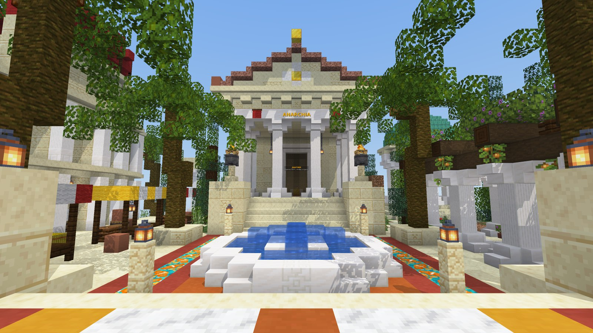
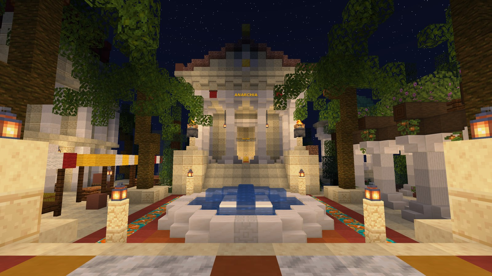
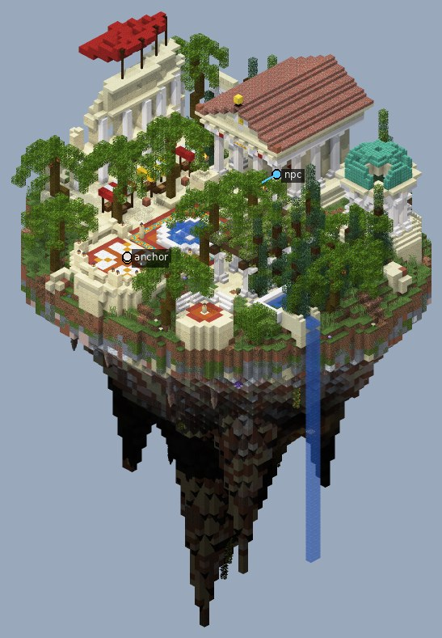
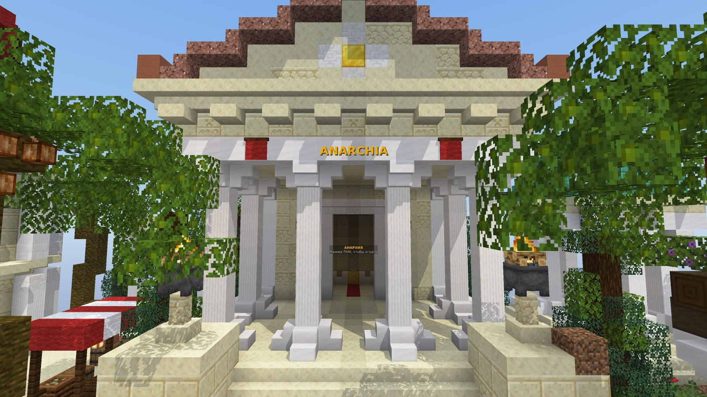
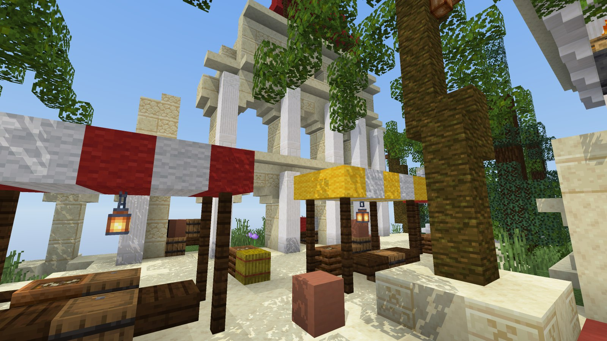
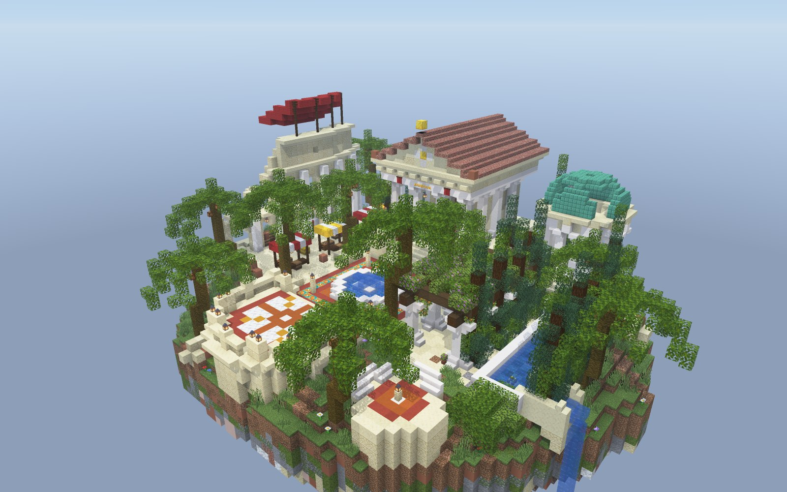
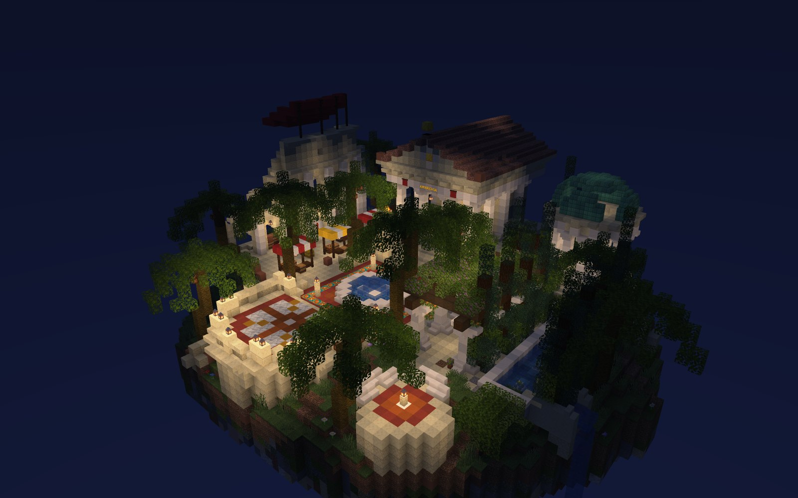

# Античный хаб под одного NPC

Компактный спавн в теме `roman_mediterranean`, собранный за 9 шагов по мотивам спавна режима «Анархия».

Игрок появляется на террасе с мозаичной розой ветров и смотрит через форум на римский храм. NPC стоит в портике между двумя центральными колоннами на фоне освещённого входа, над ним голограмма.

Вокруг:
- слева руина Колизея с полосатыми лавками рынка;
- справа пергола в зелени и круглый храмик с медным куполом;
- над всем пальмы и кипарисы.

| Ночь | Остров целиком |
|---|---|
|  |  |

| Портик, место NPC | Рынок у Колизея |
|---|---|
|  |  |

| Сверху днём | Сверху ночью |
|---|---|
|  |  |

## Что внутри

- Размер 67 × 90 × 60, это 70 тыс. блоков и 2 голограммы: подпись над NPC и золотая надпись ANARCHIA на архитраве.
- Храм `arch.temple`:
  - подиум и портик из белых колонн;
  - фриз, фронтон с медальоном, черепичная крыша;
  - внутри золотой алтарь со свечами;
  - на щеках лестницы жаровни с дымом, на архитраве красно-золотые знамёна.
- Форум:
  - мозаика из терракоты и глазури;
  - низкий фонтан: вода не поднимается выше линии взгляда со спавна на ступени храма и NPC;
  - четыре фонаря.
- Колизей:
  - два яруса сквозных арок с белыми полуколоннами;
  - красный веларий на мачтах;
  - лавки в арках, обрушенный южный край.
- Сад:
  - пергола `arch.pergola` со светящимися ягодами;
  - канал между кипарисами, с края острова течёт водопад.
- Круглый храмик с медным куполом: дым вечного огня уходит в окулус.
- Пальмы в кадках, руина колоннады, мраморная скамья-экседра над обрывом.
- Проверки:
  - `inspect lint` замечает только воду фонтана и водопада, так и задумано;
  - `inspect walk`: от спавна до NPC 31 блок пешком.

## NPC и голограммы

NPC ставится в портике на 30,5 блока севернее точки вставки и на 1 блок выше. Если вставка была у тебя под ногами в `X Y Z`, то NPC стоит в `X+0.5 Y+1 Z-30.5` и смотрит на юг (yaw 0), к спавну. В Citizens, например, достаточно встать в эту точку лицом на юг и выполнить `/npc create <имя>`: NPC займёт твоё место и поворот.

Голограммы сделаны как `text_display`:
- подпись над NPC («АНАРХИЯ / Нажми ПКМ, чтобы играть») висит выше собственного ника NPC;
- надпись ANARCHIA золотом лежит на архитраве храма.

Если у NPC-плагина своя голограмма, лишнюю можно убрать командой `/kill @e[type=text_display,distance=..2]`, стоя рядом с ней. Текст меняется через `/data merge entity`.

## Как поставить

Точка вставки — точка спавна в центре розы ветров на террасе (взгляд на север). Всё как у [фэнтези-хаба](../fantasy_hub/README.md#как-поставить-на-сервер):
- `//schem load antique_hub` и `//paste -a -e -b`;
- или попроси Claude вставить `examples/antique_hub/antique_hub.schem` мостом.

Остров уходит на 70 блоков ниже точки вставки и поднимается на 19 выше. После вставки сделай `/setworldspawn` на точке вставки с поворотом на север, чтобы игроки сразу видели храм.

При вставке через WorldEdit вода водопада начнёт течь, если рядом что-то обновится. Мост ставит блоки без физики, поэтому там водопад остаётся как на рендере.

## Как это построено

Сцена собрана 9 шагами-скриптами из папки [`pipeline/`](pipeline):

1. остров и маркеры;
2. храм `arch.temple` с местом NPC;
3. форум: мозаика, фонтан, терраса спавна с балюстрадой;
4. Колизей с лавками и рыночная улица;
5. пергола, канал с кипарисами, водопад;
6. круглый храмик с медным куполом;
7. зелень: пальмы в кадках, кипарисы, кусты, цветы;
8. свет: жаровни, фонари, знамёна, голограммы;
9. дорожки, руина колоннады, экседра и `finalize`.

Проект: тема `roman_mediterranean`, версия `1.21.4`. Для сервера 1.21.11 и новее ничего менять не нужно: мост и WorldEdit переводят блоки сами.
