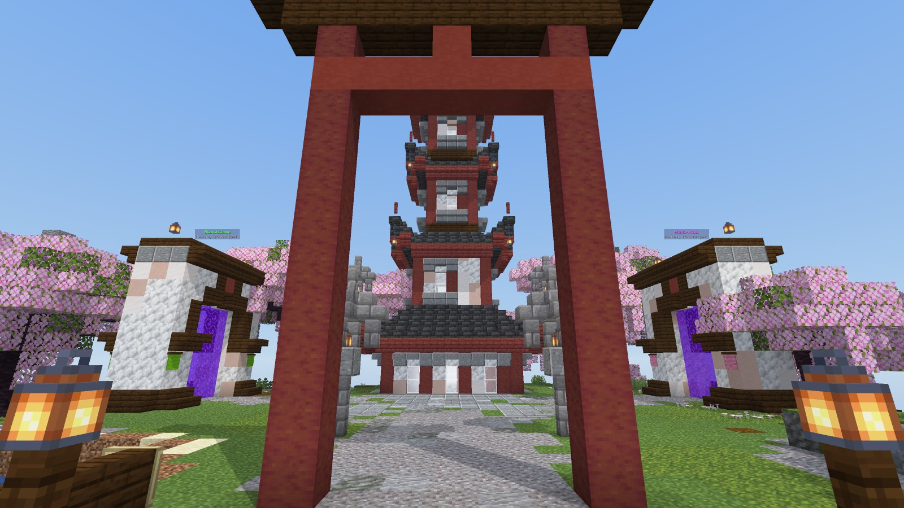
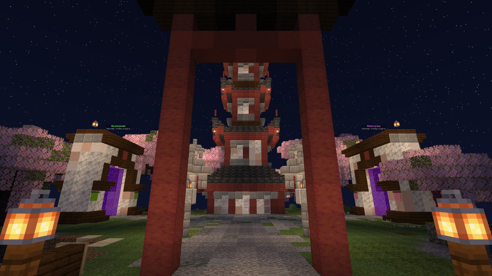
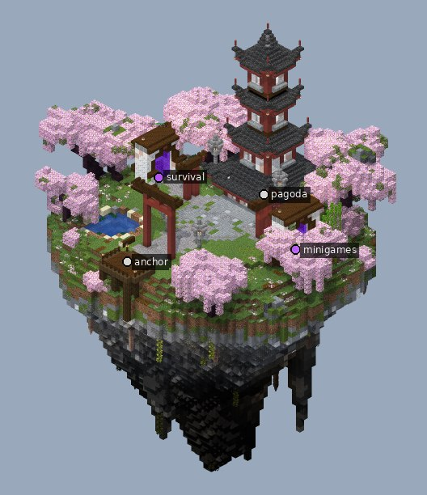

# Витрина «Азия / сакура»: остров-сад

Компактный спавн в теме `asian_sakura`, собранный за 3 шага. Игрок появляется на деревянном помосте. Большие красные тории обрамляют четырёхъярусную пагоду, и в кадр целиком попадают оба портала: «Выживание» и «Мини-игры».

| Ночь | Остров целиком |
|---|---|
|  |  |

## Что внутри

- Размер 68 × 86 × 63, это 53 тыс. блоков и 2 голограммы.
- Пагода `arch.pagoda`: под углами каждой крыши висят фонари на цепях, ярусы подсвечены изнутри, ночью окна светятся.
- Тории `arch.torii`: одни большие на главной оси и малые у каждой дорожки к порталу. Ворота показывают, куда идти.
- Гравийный двор и дорожки, каменные фонари-торо, пруд с кувшинками и скамейкой, рощи бамбука, сакуры, дзен-уголок с камнями.
- Проверки: `inspect lint` без замечаний, оба портала достижимы пешком.

## Как поставить

Точка вставки — точка спавна на помосте (взгляд на север). Всё как у [фэнтези-хаба](../fantasy_hub/README.md#как-поставить-на-сервер):
- `//schem load asian_sakura` и `//paste -a -e -b`;
- или попроси Claude вставить `examples/asian_sakura/asian_sakura.schem` мостом.

Остров уходит на 53 блока ниже точки вставки и поднимается на 32 выше.

Скрипты сборки лежат в [`pipeline/`](pipeline). Проект: тема `asian_sakura`, версия `1.21.4`.
