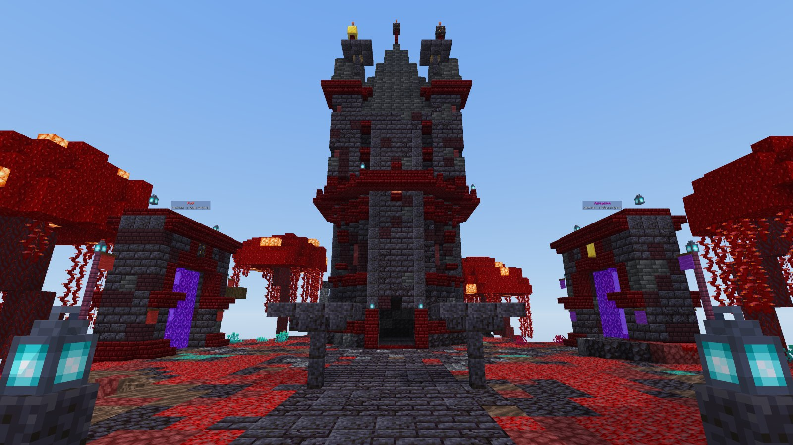
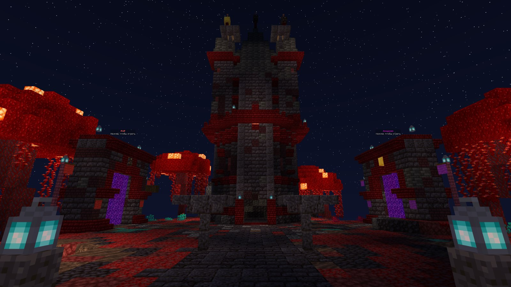
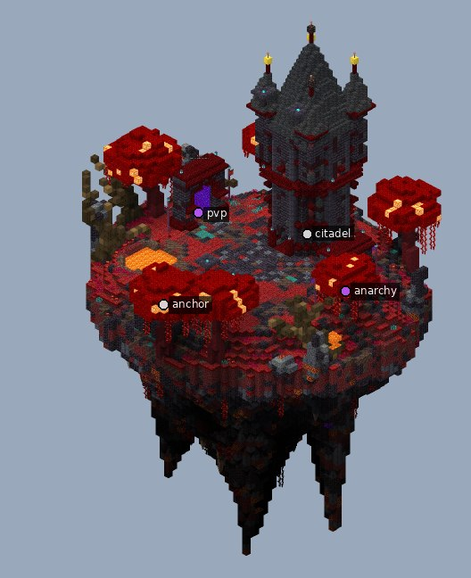

# Витрина «Тёмный / адский»: цитадель

Компактный спавн в теме `dark_infernal`, собранный за 3 шага. Игрок появляется на платформе из чернокамня. Взгляд сразу упирается в восьмигранную цитадель в конце парадной дороги. По бокам стоят гигантские багровые грибы и порталы PvP и «Анархия».

| Ночь | Остров целиком |
|---|---|
|  |  |

## Что внутри

- Размер 63 × 93 × 60, это 54 тыс. блоков и 2 голограммы.
- Цитадель `arch.tower` (восьмигранная, 4 башенки, балкон):
  - за стеклом окон светится шрумлайт;
  - ночью её подсвечивают скрытые источники у подножия и под балконом.
- Лавовый пруд и лавопад с восточного края, базальтовые шипы по краю острова, мёртвые деревья.
- Чаши-жаровни с огнём душ вдоль дороги, знамёна у порталов.
- Земля — багровый нилий и чернокамень, бирюза только редким акцентом.
- Проверки: оба портала достижимы. `inspect lint` замечает только лаву лавопада, так и задумано.

## Как поставить

Точка вставки — точка спавна на платформе (взгляд на север). Всё как у [фэнтези-хаба](../fantasy_hub/README.md#как-поставить-на-сервер):
- `//schem load dark_infernal` и `//paste -a -e -b`;
- или попроси Claude вставить `examples/dark_infernal/dark_infernal.schem` мостом.

Остров уходит на 53 блока ниже точки вставки и поднимается на 39 выше.

При вставке через WorldEdit лава лавопада начнёт течь, если рядом что-то обновится. Мост ставит блоки без физики, поэтому там лавопад остаётся как на рендере.

Скрипты сборки лежат в [`pipeline/`](pipeline). Проект: тема `dark_infernal`, версия `1.21.4`.
