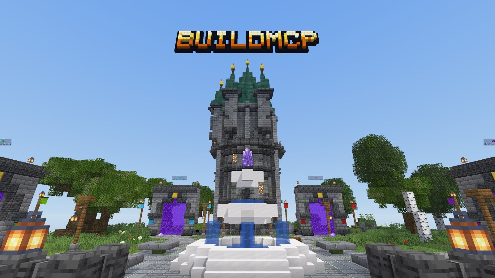
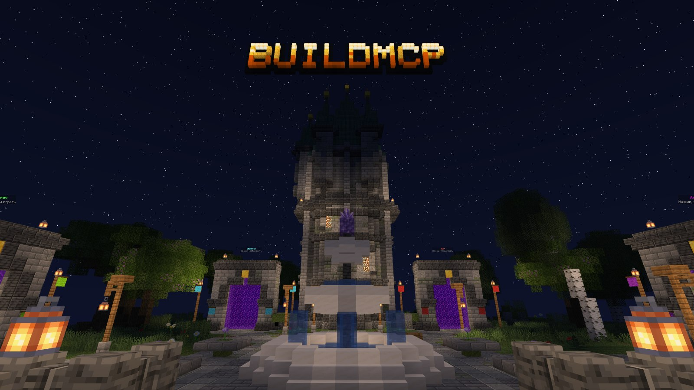
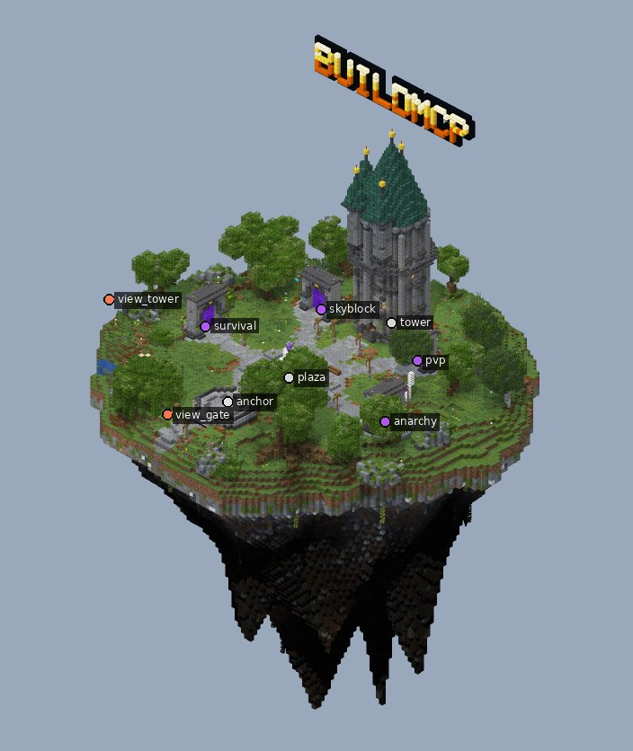
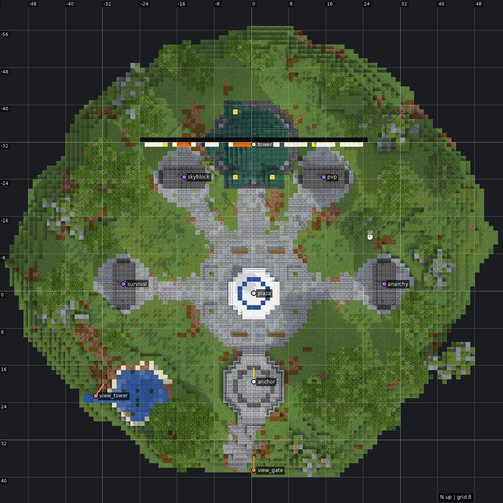

# Фэнтези-хаб на летающем острове

Демо-спавн, который Claude построил инструментами BuildMCP. Он проходит весь цикл: скрипты, рендер, критик, правки, экспорт.

Точка спавна стоит на террасе, взгляд направлен на север. Главный акцент — маг-башня:
- бирюзовые шпили с золотыми навершиями;
- 4 башенки и балкон;
- горящие окна.

Перед башней мраморный фонтан с аметистом, над ней логотип. На полукруге стоят 4 портала режимов: «Выживание», SkyBlock, PvP и «Анархия». У каждого свои цветные знамёна и голограмма с названием.

| Ночь | Остров целиком |
|---|---|
|  |  |

## Что внутри

- Размер 106 × 155 × 97. В нём 243 тыс. блоков и 4 голограммы (`text_display`).
- Остров:
  - плоская площадь в центре и мягкие холмы по краям;
  - пруд с водопадом;
  - низ светлый, с аметистовыми друзами и глоустоном.
- Все порталы достижимы пешком от точки спавна (проверено `inspect walk`).
- Блоки прошли `finalize`: заборы, стены и ступени соединены так, как их посчитает игра. Поэтому вставка без физики выглядит так же, как на рендере.
- Версия сцены 1.21.4. Мост и WorldEdit переводят её на более новый сервер сами.

## Как поставить на сервер

**Через BuildMCP (мост BuildBridge).** Встань туда, где должна быть точка спавна, и скажи Claude:

> вставь examples/fantasy_hub/fantasy_hub.schem, чтобы точка спавна была у меня под ногами

Перед вставкой делается бэкап, отменить можно через `server_undo` или `/bb undo`.

**Через WorldEdit / FAWE.**

1. Скопируй `fantasy_hub.schem` в `plugins/WorldEdit/schematics/` (или `plugins/FastAsyncWorldEdit/schematics/`).
2. Встань в будущую точку спавна и смотри на север.
3. Выполни `//schem load fantasy_hub`, затем `//paste -a -e -b`:
   - `-a` пропускает воздух;
   - `-e` вставляет голограммы;
   - `-b` вставляет биомы.

Остров уходит на 93 блока ниже точки вставки и поднимается на 61 блок выше. Ставь спавн на высоте 100–200.

После вставки сделай `/setworldspawn` (или `/setspawn` в EssentialsX) на террасе с поворотом на север, чтобы игроки сразу видели башню.

## Как это построено

Сцена собрана 9 шагами-скриптами из папки [`pipeline/`](pipeline). Каждый шаг — один вызов `run_script`:

1. разметка: маркеры спавна и порталов, зоны;
2. остров: `terrain.island`;
3. объёмы: башня `arch.tower`, порталы `props.portal_frame`, дорожки;
4. мощение площади и дорожек, фонтан `props.fountain`;
5. терраса спавна;
6. органика: пруд, деревья, камни, трава и цветы;
7. водопад, фонари, скамейки, клумбы, знамёна;
8. логотип `text` над башней;
9. ночной свет и `finalize`.

Генераторы детерминированы: одни и те же скрипты в любой сессии дают тот же остров. Чтобы пересобрать демо, создай проект (`project_new`, тема `fantasy_medieval`, версия `1.21.4`) и выполни скрипты по порядку.
