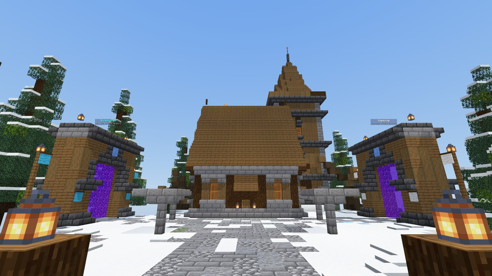
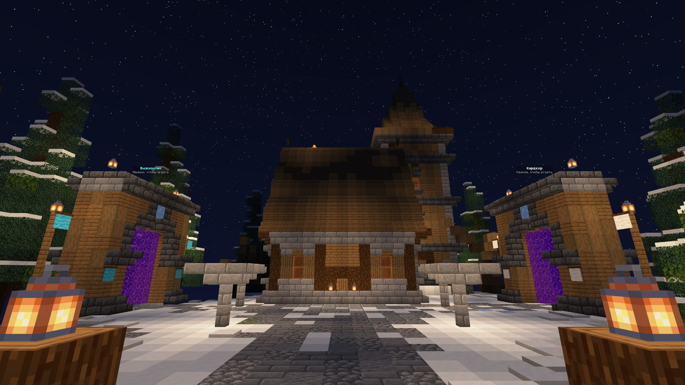
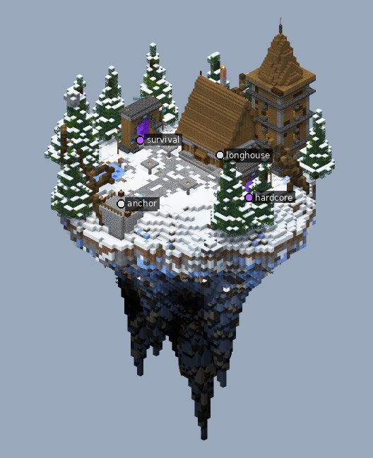

# Витрина «Зима / север»: северный форпост

Компактный спавн в теме `winter_north`, собранный за 3 шага. Игрок появляется на каменной площадке и смотрит по заснеженной дороге на длинный дом с крутой крышей. За его плечом стоит дозорная башня. Двор обрамляют порталы «Выживание» и «Хардкор» и высокие ели в снегу.

| Ночь | Остров целиком |
|---|---|
|  |  |

## Что внутри

- Размер 61 × 104 × 62, это 55 тыс. блоков и 2 голограммы.
- Длинный дом `arch.house` (северная крыша, крыльцо, дымоход) и квадратная башня `arch.tower` из смешанной ели. Окна башни горят за стеклом.
- Замёрзший пруд (лёд с полыньями), ели с шапками снега, валуны.
- Снежный покров: слои снега, дорога из камня, припорошенная снегом.
- Костры в каменных чашах по углам двора, знамёна у порталов.
- Проверки: `inspect lint` без замечаний, оба портала достижимы пешком.

## Как поставить

Точка вставки — точка спавна на площадке (взгляд на север). Всё как у [фэнтези-хаба](../fantasy_hub/README.md#как-поставить-на-сервер):
- `//schem load winter_north` и `//paste -a -e -b`;
- или попроси Claude вставить `examples/winter_north/winter_north.schem` мостом.

Остров уходит на 68 блоков ниже точки вставки и поднимается на 35 выше.

Скрипты сборки лежат в [`pipeline/`](pipeline). Проект: тема `winter_north`, версия `1.21.4`.
